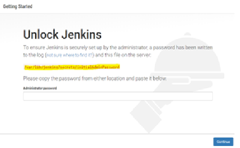
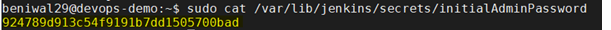
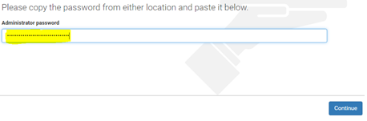
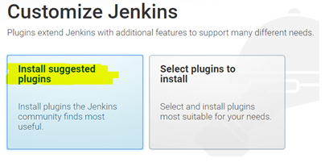
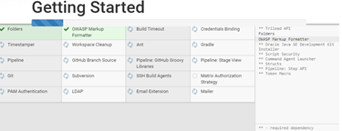
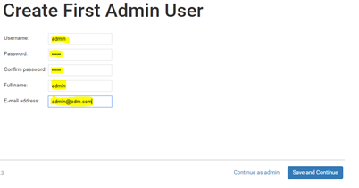
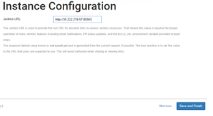
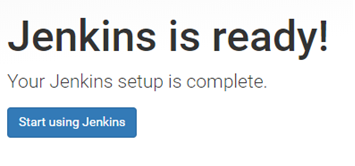
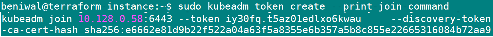
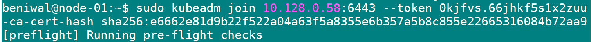

### Steps to Install Jenkins on master

#####	Open Chrome/firefox and go to (See to it that firewall rules on cloud  network allow port 8080):

{public IP of VM}:8080

* Below screen would get opened

*	Copy the contents of file using command “sudo cat <file_name_with_path> 

*	Specify the copied password in appropriate column and click continue

 
*	Click on “Install suggested plugins”

*	Let all the installations get finished

*	Specify various values (e.g. user and password as admin) for new admin user and click on Save and Continue. 

*	Click on Save and Finish:

*	Click on “Start using Jenkins”

=========================================================================================================

#### For Docker to run without sudo run below command as regular user and it will be effective only after reboot of the VM

sudo usermod -aG docker $USER

=========================================================================================================

#### For Kubernetes run below command as regular user on Master

  sudo kubeadm init --pod-network-cidr=192.168.0.0/16
  
  mkdir -p $HOME/.kube
  
  sudo cp -i /etc/kubernetes/admin.conf $HOME/.kube/config
  
  sudo chown $(id -u):$(id -g) $HOME/.kube/config

  curl https://docs.projectcalico.org/manifests/calico.yaml -O
  
  kubectl apply -f calico.yaml
  
#### Command to get token for joining node and use it in subsequent command on node
  
  sudo kubeadm token create --print-join-command
  
  
  
#### For Kubernetes run output of above command on Node machine

  

#### Update /etc/hosts file on puppet node machine with ip of puppet master

  sudo nano /etc/hosts

  <internal_ip_of_master_vm> puppet

#### Run below command on puppet node machine for sending certificate request to master

  sudo /opt/puppetlabs/bin/puppet agent --test
  
#### Run below command on puppet master machine for setting up puppet node

  sudo /opt/puppetlabs/bin/puppetserver ca list
  
  sudo /opt/puppetlabs/bin/puppetserver ca sign --all

#### Run below command on nagios master machine for setting up password of nagiosadmin

  sudo htpasswd -c /usr/local/nagios/etc/htpasswd.users nagiosadmin
